# Location

The conference will be held at the [Seaport Hotel & World Trade Center](http://www.seaportboston.com) in the Boston [Seaport District](https://www.bostonusa.com/about-boston/boston-neighborhoods/seaport-district). Workshops will be hosted by [The Center for Geographic Analysis at Harvard University](http://gis.harvard.edu/) in neighboring Cambridge, MA.

# Lodging

A room block has been reserved for event participants at the [Seaport Hotel & World Trade Center](http://www.seaportboston.com). The discount block rate for conference attendees is $259.00 + tax (14.45%) + Hotel Fee ($1.00) & Service fee ($2.00) per room per night if registered by July 24, 2017 or until the block is full.

[Reserve a room in the block](http://reservations.travelclick.com/131437?groupID=1616128){: .btn}

# Extracurriculars

### Icebreaker - Tuesday, August 15th - Harpoon Brewery

By John Phelan - Own work, CC BY-SA 3.0, [https://commons.wikimedia.org/w/index.php?curid=18498782](https://commons.wikimedia.org/w/index.php?curid=18498782)

The Icebreaker will take place Tuesday, August 15th at the [Harpoon Brewery](http://www.harpoonbrewery.com/).  Try local beers and ciders in the beer hall accompanied by handmade freshly baked pretzels cooked in beer and served with warm dipping sauces.  Participants can take a walkthrough of the brewery as well.  See [What’s on tap](http://www.harpoonbrewery.com/breweries/boston/whats-on-tap)!

### Welcome Social - Wednesday August 16th - Conference Venue

The Welcome Social will take place Wednesday, August 16th at the conference venue overlooking beautiful Boston Harbor.  Get to know your fellow conference goers from around the world! 

### Gala - Thursday August 17th - New England Aquarium

The Gala will take place Thursday, August 17th at the [New England Aquarium](http://www.neaq.org/). NEAQ has for almost 50 years been one of the premier visitor attractions in Boston and is a leader in ocean exploration and marine conservation.  Attendees will enjoy a strolling dinner while taking in all the exhibits starring the newly renovated cylindrical 4-story tall [Giant Ocean Tank](http://www.neaq.org/exhibit/giant-ocean-tank/).  The GOT replicates a Caribbean coral reef and features 90 year old [Myrtle the turtle](http://www.neaq.org/animal/green-sea-turtle/) and over 1,000 sea creatures.  The [Shark and Ray Touch Tank](http://www.neaq.org/exhibit/shark-ray-touch-tank/) will allow for personal interaction with these animals (the rays love to be petted!).  In addition to indoor marine life, a patio space on the harbor will provide a chance to view the summer boat traffic in the harbor.

# Visiting Boston

Boston is a dynamic city with a million things to do!  Here are some tips and suggestions for visiting Boston! 

[Boston, Cambridge and New England slideshow from the Boston Location Organizing Committee](https://photos.google.com/share/AF1QipO1BxZpRm8RRQRYjT91hzWUCYv1TT6qx_aJBumEZuyygkcqd4TpSEyj19IBd_z6gQ?key=RS1VTDB4Q2E3TTBYREdBQzJMbGt5S1dsU1lVQ0V3)

[Boston Convention and Visitors Bureau Guide](https://www.bostonusa.com/)

[City of Boston’s Things to Do Around Boston](https://www.boston.gov/departments/tourism-sports-and-entertainment/things-do-around-boston)

[Wikitravel Boston Page](http://wikitravel.org/en/Boston)

[TripAdvisor First-time Boston Visitor Page](https://www.tripadvisor.com/Travel-g60745-s409/Boston:Massachusetts:First.Time.Visitors.html)

[Google Boston Travel Guide](https://www.google.com/destination?q=boston+historic+sites&safe=active&espv=2&site=search&output=search&dest_mid=/m/01cx_&sa=X&ved=0ahUKEwiPy77svbjRAhVM7iYKHf1WAW8Qri4IoAIwDw)

[4 Minute Drone Video Over Boston](https://www.youtube.com/watch?v=LrNfgCPT7Vk)

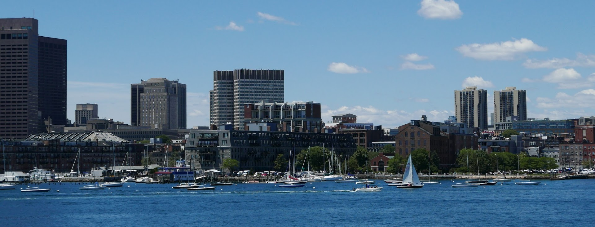

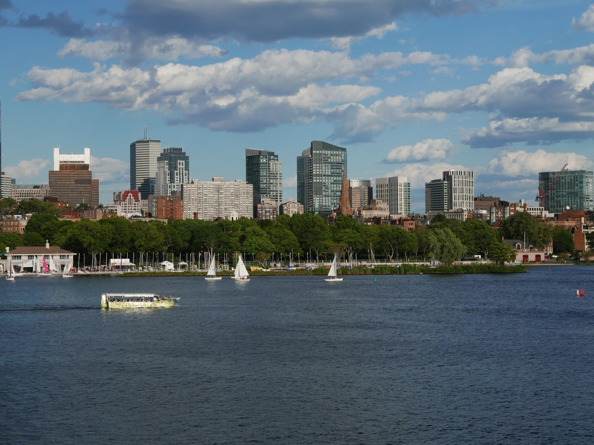

### Getting around:

City of Boston’s [Getting Around Boston](https://www.boston.gov/getting-around-boston)
[MBTA subway, rail, bus and ferry system](http://www.mbta.com/)

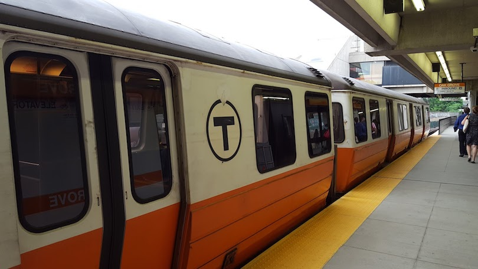

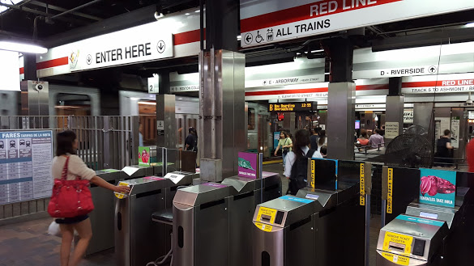

[Hubway bike share](https://www.thehubway.com/)

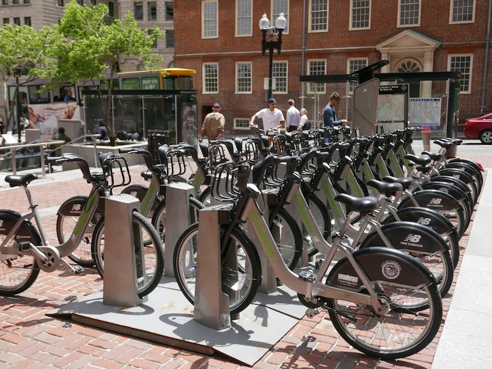

### Harvard Square and Harvard University (site of workshops)

[Harvard Square](http://www.harvardsquare.com/)

[Harvard University](http://www.harvard.edu/on-campus/visit-harvard)

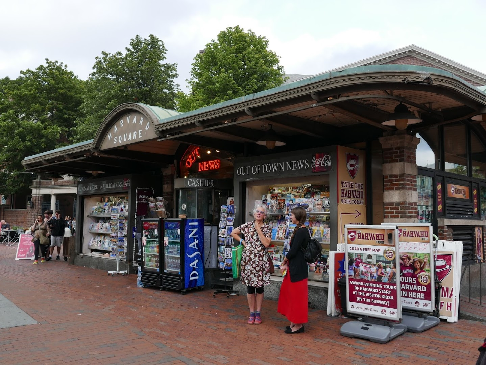

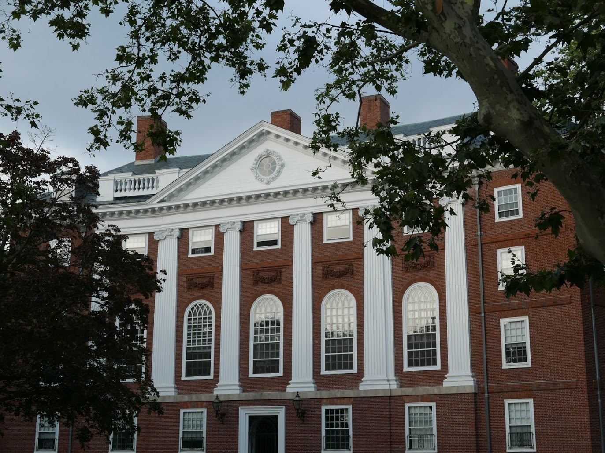

### Waterfront
The conference takes place in the dynamic and changing Waterfront neighborhood.  See what’s here or nearby.

[Boston Harborwalk](http://bostonharborwalk.com/)

[Boston Harbor Islands](http://www.bostonharborislands.org/)

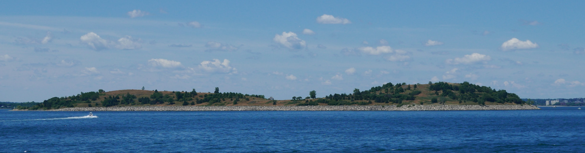

[Rose Kennedy Greenway](http://www.rosekennedygreenway.org/)

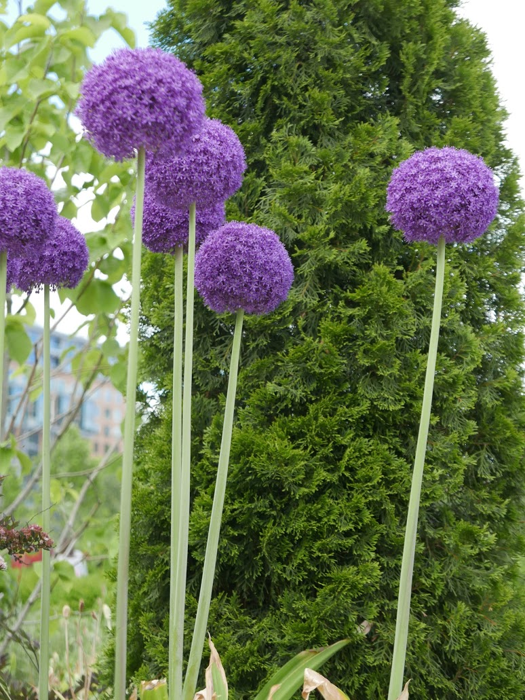

[Lawn on D](https://signatureboston.com/lawn-on-d)

[Boston Harbor Cruises](https://signatureboston.com/lawn-on-d)

### Outdoor recreation:

[Charles River Canoe and Kayak](http://www.paddleboston.com/main.php)

[Lawn on D](https://signatureboston.com/lawn-on-d)

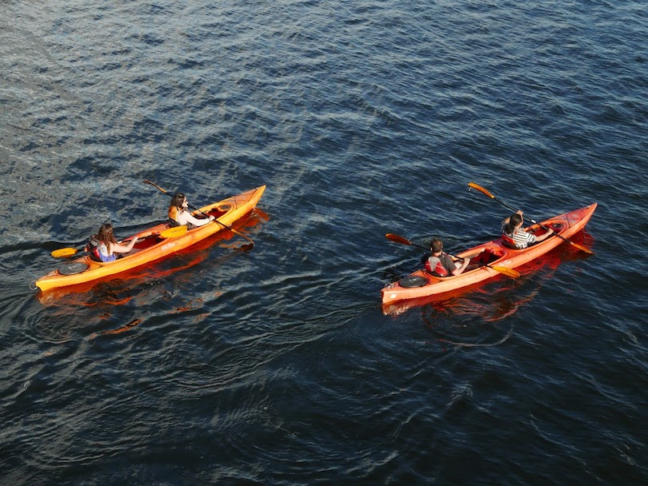

[Boston Common](http://friendsofthepublicgarden.org/our-parks/boston-common/)

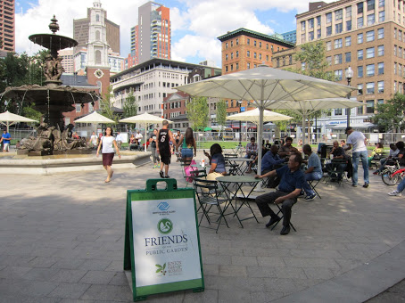

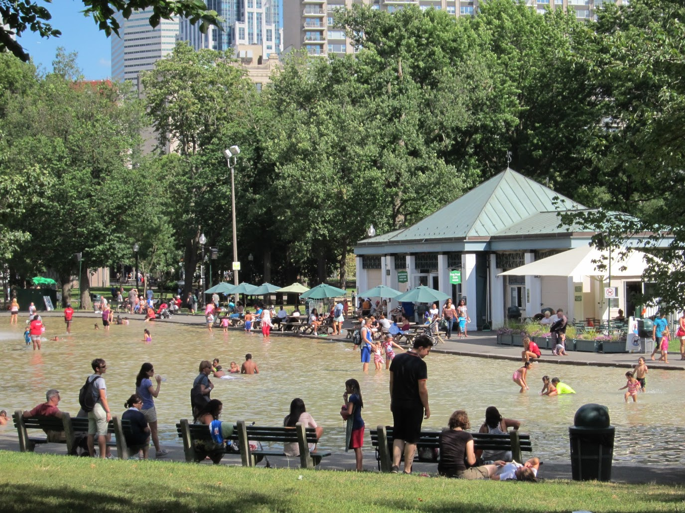

[Boston Public Garden](http://friendsofthepublicgarden.org/)

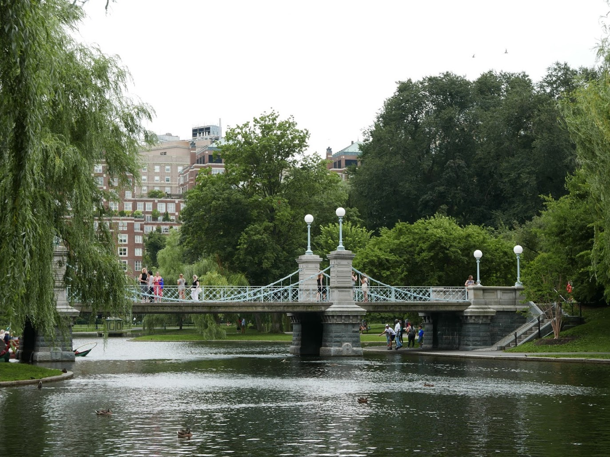

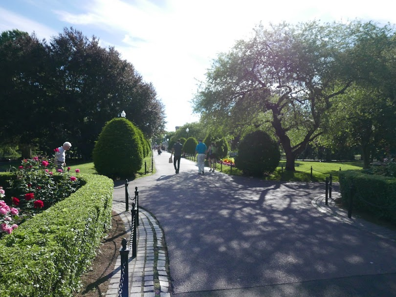

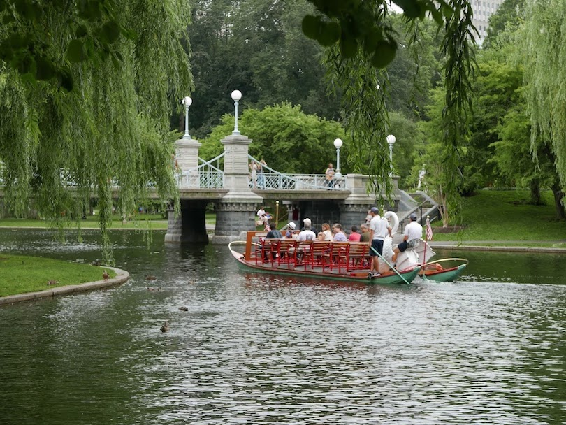

[The Esplanade](http://esplanadeassociation.org/the-esplanade/) - along Charles River

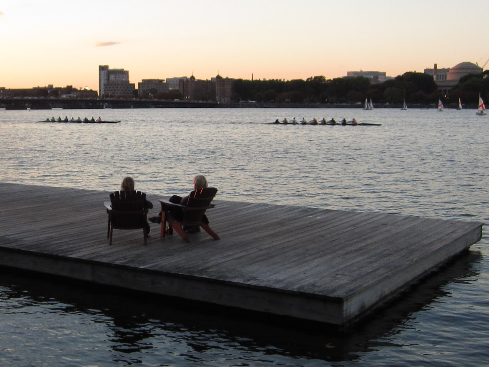

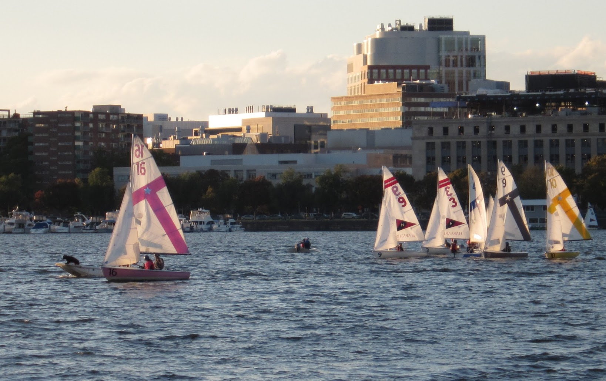

### Sporting events

[Red Sox](http://m.redsox.mlb.com/schedule/list/2017/08) baseball - there will be 4 home games during FOSS4G week - Aug 15, 16, 18 and 19th.

### Museums and Libraries

[Institute of Contemporary Art](https://www.icaboston.org/)

[Museum of Fine Arts](http://www.mfa.org/)

[Boston Public Library](http://www.bpl.org/)

[Mary Baker Eddy Library Mapparium](http://www.marybakereddylibrary.org/project/mapparium/)

[Harvard Art Museums]([Boston Public Library](http://www.bpl.org/))

[Harvard Museum of Natural History](http://hmnh.harvard.edu/)

[Isabella Stewart Gardner Museum](http://www.gardnermuseum.org/)

[Children’s Museum](http://www.bostonchildrensmuseum.org/)

[Museum of Science](https://www.mos.org/)

[Boston Museum of African American History](http://maah.org/)

### Theaters

[ArtsBoston cultural calendar](http://calendar.artsboston.org/)

[Boston Opera House](http://www.bostonoperahouse.com/)

[Wang Theater](http://www.bochcenter.org/Discover/Our-Theatres/Wang-Theatre/Wang-Theatre-Landing-Page)

[Paramount Theater](https://artsemerson.org/Online//)

[Modern Theater](http://www.suffolk.edu/ModernTheatre/)

[Cutler Majestic Theater](https://cutlermajestic.org/Online/)

[Shubert Theater](http://www.bochcenter.org/)

[Charles Playhouse](https://www.blueman.com/)

[Huntington Theater](http://www.huntingtontheatre.org/)

[American Repertory Theater](https://americanrepertorytheater.org/)

[Lyric Stage](http://www.lyricstage.com/)

[Central Square Theater](https://www.centralsquaretheater.org/)

[Boston Center for the Arts](http://www.bcaonline.org/)

### History

[Boston Tea Party Ships & Museum](https://www.bostonteapartyship.com/)

[Quincy Market](https://en.wikipedia.org/wiki/Quincy_Market)

[Faneuil Hall](http://www.faneuilhall.com/)

[Paul Revere House](https://www.paulreverehouse.org/)

[Granary Burial Ground](https://www.thefreedomtrail.org/freedom-trail/granary-burying-ground.shtml)

[Old North Church](http://oldnorth.com/historic-site/about-us/)

[Freedom Trail](https://www.thefreedomtrail.org/)

### Food 

[Boston Public Market](https://bostonpublicmarket.org/)

