# Location
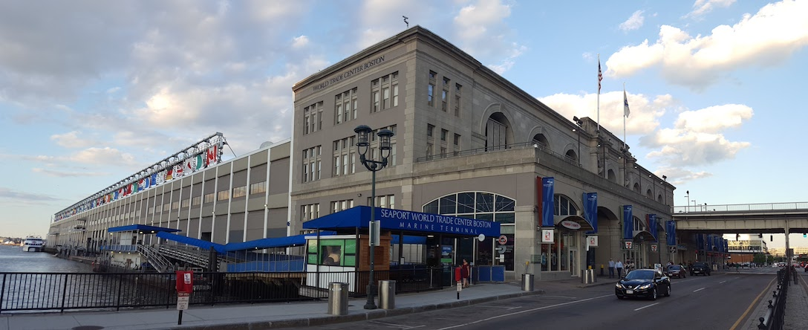{: .not}

The conference will be held at the [Seaport Hotel & World Trade Center](http://www.seaportboston.com) in the Boston [Seaport District](https://www.bostonusa.com/about-boston/boston-neighborhoods/seaport-district). Workshops will be hosted by [The Center for Geographic Analysis at Harvard University](http://gis.harvard.edu/) in neighboring Cambridge, MA.

To travel to the Workshops from the Seaport, we suggest taking the [MBTA Red Line](https://www.google.com/maps/dir/Seaport+Hotel+%26+World+Trade+Center,+Seaport+Lane,+Boston,+MA/Cgis+Knafel,+1737+Cambridge+St,+Cambridge,+MA+02138/@42.3614064,-71.0971916,14z/data=!3m1!4b1!4m14!4m13!1m5!1m1!1s0x89e3707897da486f:0x33bdef927d376f5b!2m2!1d-71.0404886!2d42.351369!1m5!1m1!1s0x89e37744241b934f:0x70603c849cad1301!2m2!1d-71.1132356!2d42.375638!3e3)

If you are flying into Logan Airport, we suggest taking the [MBTA Silver Line](https://www.google.com/maps/dir/Logan+Airport,+Boston,+MA/Seaport+Hotel+%26+World+Trade+Center,+Seaport+Lane,+Boston,+MA/@42.3582862,-71.0353684,15z/data=!3m2!4b1!5s0x89e3707856a80993:0x77b7ec9a7b4713e8!4m14!4m13!1m5!1m1!1s0x89e37014d5da4937:0xc9394c31f2d5144!2m2!1d-71.0095602!2d42.3656132!1m5!1m1!1s0x89e3707897da486f:0x33bdef927d376f5b!2m2!1d-71.0404886!2d42.351369!3e3) to the Conference Hotel. Service is FREE *from* the airport.

# Who's Attending?

#### Origins of Conference Attendees

<iframe width="65%" height="350" frameborder="0" src="https://atardif.carto.com/builder/8e388472-1954-11e7-9086-0e3ebc282e83/embed" allowfullscreen webkitallowfullscreen mozallowfullscreen oallowfullscreen msallowfullscreen></iframe>

# Lodging

{: .not}

**[Yotel Boston](http://www.yotel.com/en/hotels/yotel-boston){:target="_blank_"}** is a short 3 block walk to the Seaport World Trade Center venue. A room block has been reserved as the overflow hotel for FOSS4G 2017. The discount rate for conference attendees is $239.00 + tax (14.45%) per room per night.

[Reserve a room in the block](https://gc.synxis.com/rez.aspx?Hotel=76937&Chain=17799&template=YOBOS1&group=1708OSGEOF){: .btn style="background-color:gray;"}

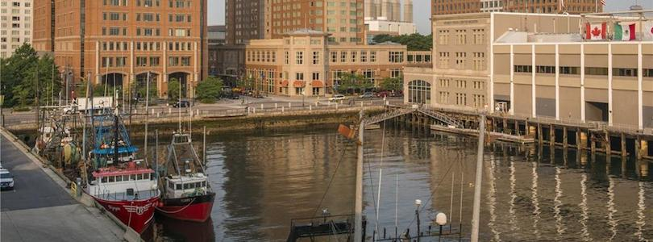{: .not}

A room block has been reserved for event participants at the **[Seaport Hotel & World Trade Center](http://www.seaportboston.com)**. The discount block rate for conference attendees is $259.00 + tax (14.45%) + Hotel Fee ($1.00) & Service fee ($2.00) per room per night if registered by July 24, 2017 or until the block is full.

[Reserve a room in the block](http://reservations.travelclick.com/131437?groupID=1616128){: .btn style="text-decoration:line-through; background-color:gray;"} <mark>The Seaport Hotel & World Trade Center room block is FULL.</mark>

#### Other Nearby Hotels

- [Renaissance Boston Waterfront](http://www.marriott.com/hotels/travel/boswf-renaissance-boston-waterfront-hotel/){:target="_blank"}

- [Westin Boston Waterfront](http://www.westinbostonwaterfront.com/?EM=EM_aa_Google_My_Business__WI_1528__NAD_FM&SWAQ=94Z388){:target="_blank"}

- [Aloft Boston Seaport](http://www.aloftbostonseaport.com/?EM=EM_aa_Google_My_Business__AL_4142__NAD_FM&SWAQ=94Z701){:target="_blank"}

- [Element Boston Seaport](http://www.elementbostonseaport.com/?EM=EM_aa_Google_My_Business__EL_4143__NAD_FM&SWAQ=94Z702){:target="_blank"}

- [The Envoy Hotel](http://theenvoyhotel.com/){:target="_blank_"}

# Extracurriculars

### Welcome Social - Tuesday, August 15th - Harpoon Brewery

<strong>Harpoon Brewery Tickets are <strong style="color:red;">SOLD OUT</strong> as of May 16th 2017</strong>

 By John Phelan - Own work, CC BY-SA 3.0, <https://commons.wikimedia.org/w/index.php?curid=18498782>

The Icebreaker will take place Tuesday, August 15th at the [Harpoon Brewery](http://www.harpoonbrewery.com/). Try local beers and ciders in the beer hall accompanied by handmade freshly baked pretzels cooked in beer and served with warm dipping sauces. Participants can take a walkthrough of the brewery as well. See [What's on tap](http://www.harpoonbrewery.com/breweries/boston/whats-on-tap)!

### Icebreaker - Wednesday August 16th - Conference Venue

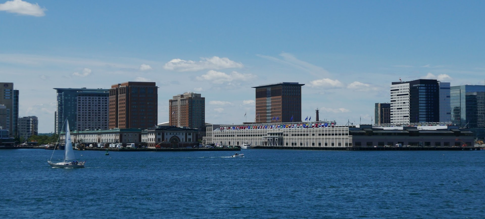

The Welcome Social will take place Wednesday, August 16th at the conference venue overlooking beautiful Boston Harbor. Get to know your fellow conference goers from around the world!

### Gala - Thursday August 17th - New England Aquarium

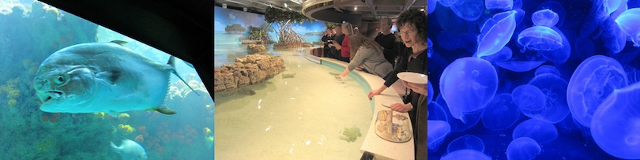

The Gala will take place Thursday, August 17th at the [New England Aquarium](http://www.neaq.org/). NEAQ has for almost 50 years been one of the premier visitor attractions in Boston and is a leader in ocean exploration and marine conservation. Attendees will enjoy a strolling dinner while taking in all the exhibits starring the newly renovated cylindrical 4-story tall [Giant Ocean Tank](http://www.neaq.org/exhibit/giant-ocean-tank/). The GOT replicates a Caribbean coral reef and features 90 year old [Myrtle the turtle](http://www.neaq.org/animal/green-sea-turtle/) and over 1,000 sea creatures. The [Shark and Ray Touch Tank](http://www.neaq.org/exhibit/shark-ray-touch-tank/) will allow for personal interaction with these animals (the rays love to be petted!). In addition to indoor marine life, a patio space on the harbor will provide a chance to view the summer boat traffic in the harbor.

# Visiting Boston

Boston is a dynamic city with a million things to do! Here are some tips and suggestions for visiting Boston!

- [Boston, Cambridge and New England slideshow from the Boston Location Organizing Committee](https://photos.google.com/share/AF1QipO1BxZpRm8RRQRYjT91hzWUCYv1TT6qx_aJBumEZuyygkcqd4TpSEyj19IBd_z6gQ?key=RS1VTDB4Q2E3TTBYREdBQzJMbGt5S1dsU1lVQ0V3){: .not}
- [Boston Convention and Visitors Bureau Guide](https://www.bostonusa.com/){: .not}
- [City of Boston's Things to Do Around Boston](https://www.boston.gov/departments/tourism-sports-and-entertainment/things-do-around-boston){: .not}
- [Wikitravel Boston Page](http://wikitravel.org/en/Boston){: .not}
- [TripAdvisor First-time Boston Visitor Page](https://www.tripadvisor.com/Travel-g60745-s409/Boston:Massachusetts:First.Time.Visitors.html){: .not}
- [Google Boston Travel Guide](https://www.google.com/destination?q=boston+historic+sites&safe=active&espv=2&site=search&output=search&dest_mid=/m/01cx_&sa=X&ved=0ahUKEwiPy77svbjRAhVM7iYKHf1WAW8Qri4IoAIwDw){: .not}
- [4 Minute Drone Video Over Boston](https://www.youtube.com/watch?v=LrNfgCPT7Vk){: .not}

## Getting around:

- [Getting Around Boston](https://www.boston.gov/getting-around-boston){: .not}
- [MBTA subway, rail, bus and ferry system](http://www.mbta.com/){: .not}
- [Hubway bike share](https://www.thehubway.com/){: .not}

<ul class="photo-gallery">
  
    <li></li>
  
</ul>

## Harvard Square and Harvard University (site of workshops)

- [Harvard Square](http://www.harvardsquare.com/){: .not}
- [Harvard University](http://www.harvard.edu/on-campus/visit-harvard){: .not}

<ul class="photo-gallery">
  
    <li></li>
  
</ul>

## Waterfront

The conference takes place in the dynamic and changing Waterfront neighborhood. See what's here or nearby.

- [Boston Harborwalk](http://bostonharborwalk.com/){: .not}
- [Boston Harbor Islands](http://www.bostonharborislands.org/){: .not}
- [Rose Kennedy Greenway](http://www.rosekennedygreenway.org/){: .not}
- [Lawn on D](https://signatureboston.com/lawn-on-d){: .not}
- [Boston Harbor Cruises](http://www.bostonharborcruises.com/){: .not}

<ul class="photo-gallery">
  
    <li></li>
  
</ul>

## Outdoor recreation:

[Charles River Canoe and Kayak](http://www.paddleboston.com/main.php){: .not}
[Lawn on D](https://signatureboston.com/lawn-on-d){: .not}
[Boston Common](http://friendsofthepublicgarden.org/our-parks/boston-common/){: .not}
[Boston Public Garden](http://friendsofthepublicgarden.org/){: .not}
[The Esplanade](http://esplanadeassociation.org/the-esplanade/){: .not}

<ul class="photo-gallery">
  
    <li></li>
  
</ul>

## Sporting events

[Red Sox](http://m.redsox.mlb.com/schedule/list/2017/08) baseball - there will be 4 home games during FOSS4G week - Aug 15, 16, 18 and 19th.

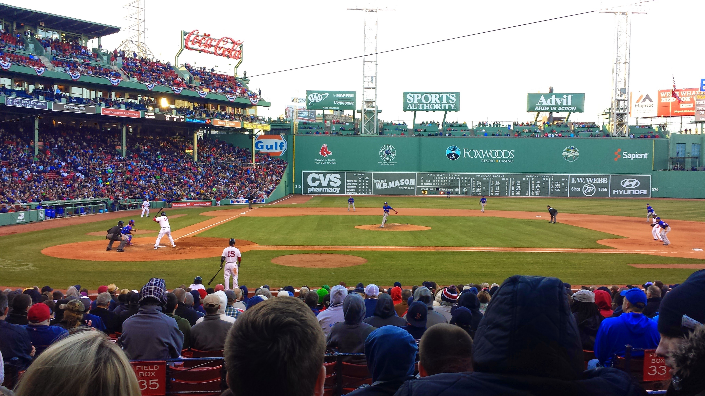

## Museums and Libraries

[Institute of Contemporary Art](https://www.icaboston.org/)

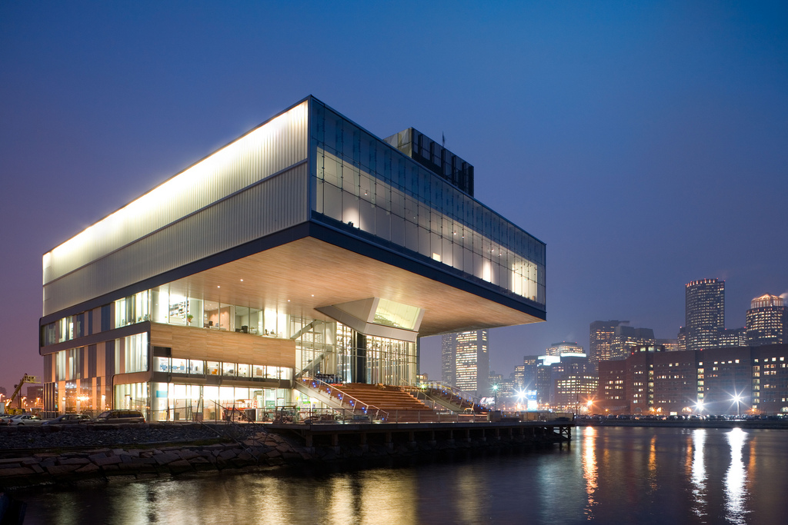 [By Smart Destinations from Boston, USA](http://creativecommons.org/licenses/by-sa/2.0), via Wikimedia Commons

[Museum of Fine Arts](http://www.mfa.org/)

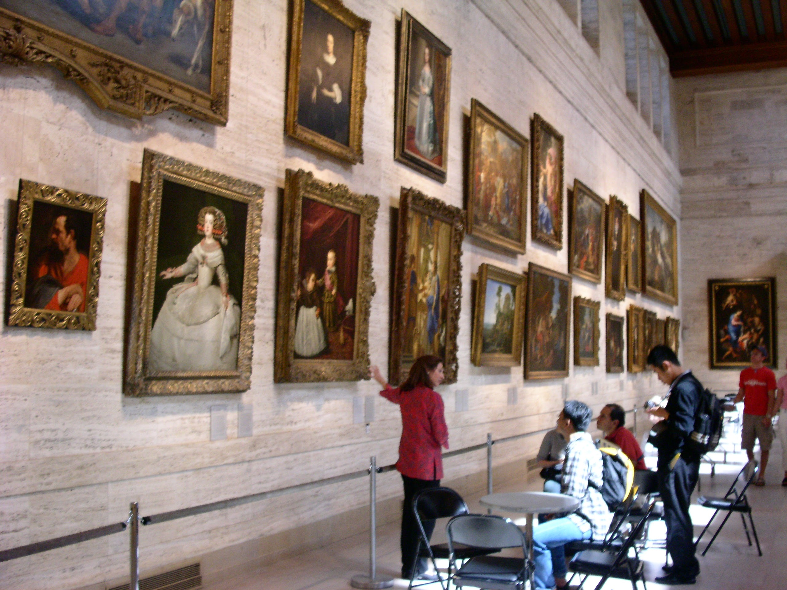

[Boston Public Library](http://www.bpl.org/)

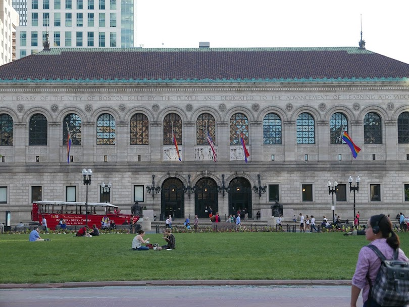

[Mary Baker Eddy Library Mapparium](http://www.marybakereddylibrary.org/project/mapparium/)

[Harvard Art Museums]([Boston Public Library](http://www.bpl.org/))

[Harvard Museum of Natural History](http://hmnh.harvard.edu/)

[Isabella Stewart Gardner Museum](http://www.gardnermuseum.org/)

[Children's Museum](http://www.bostonchildrensmuseum.org/)

[Museum of Science](https://www.mos.org/)

[Boston Museum of African American History](http://maah.org/)

## Theaters

[ArtsBoston cultural calendar](http://calendar.artsboston.org/)

[Boston Opera House](http://www.bostonoperahouse.com/)

[Wang Theater](http://www.bochcenter.org/Discover/Our-Theatres/Wang-Theatre/Wang-Theatre-Landing-Page)

[Paramount Theater](https://artsemerson.org/Online//)

[Modern Theater](http://www.suffolk.edu/ModernTheatre/)

[Cutler Majestic Theater](https://cutlermajestic.org/Online/)

[Shubert Theater](http://www.bochcenter.org/)

[Charles Playhouse](https://www.blueman.com/)

[Huntington Theater](http://www.huntingtontheatre.org/)

[American Repertory Theater](https://americanrepertorytheater.org/)

[Lyric Stage](http://www.lyricstage.com/)

[Central Square Theater](https://www.centralsquaretheater.org/)

[Boston Center for the Arts](http://www.bcaonline.org/)

## History

[Boston Tea Party Ships & Museum](https://www.bostonteapartyship.com/)

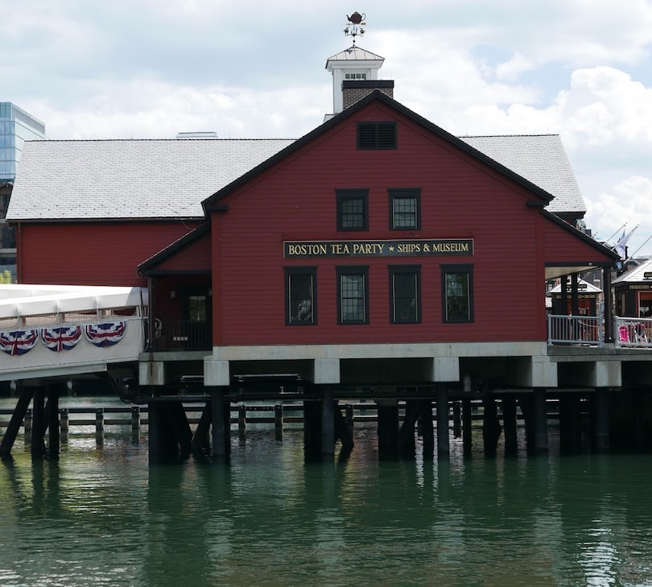

[Quincy Market](https://en.wikipedia.org/wiki/Quincy_Market)

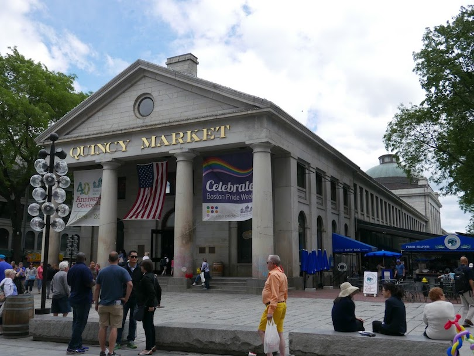

[Faneuil Hall](http://www.faneuilhall.com/)

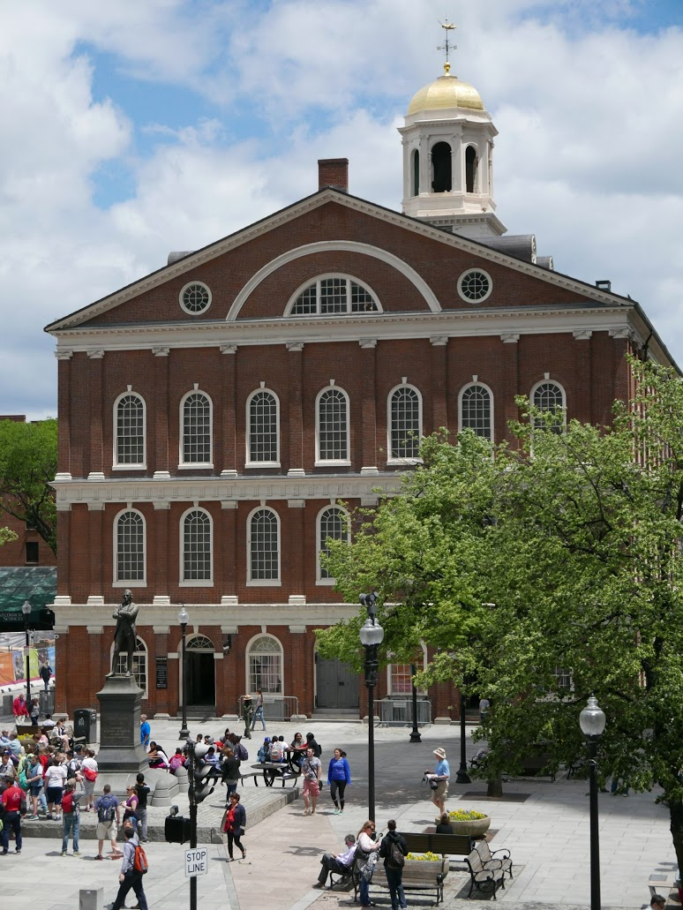

[Paul Revere House](https://www.paulreverehouse.org/)

[Granary Burial Ground](https://www.thefreedomtrail.org/freedom-trail/granary-burying-ground.shtml)

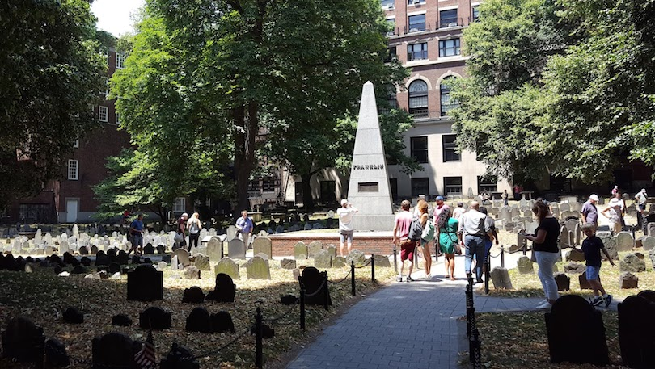

[Old North Church](http://oldnorth.com/historic-site/about-us/)

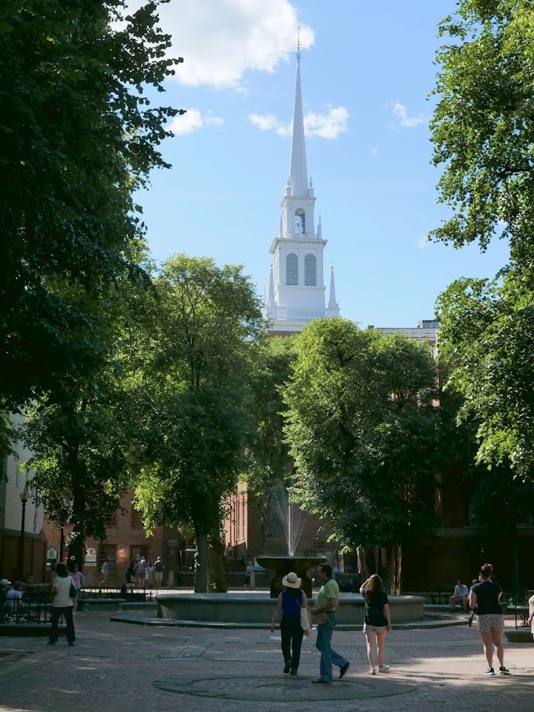

[Freedom Trail](https://www.thefreedomtrail.org/)

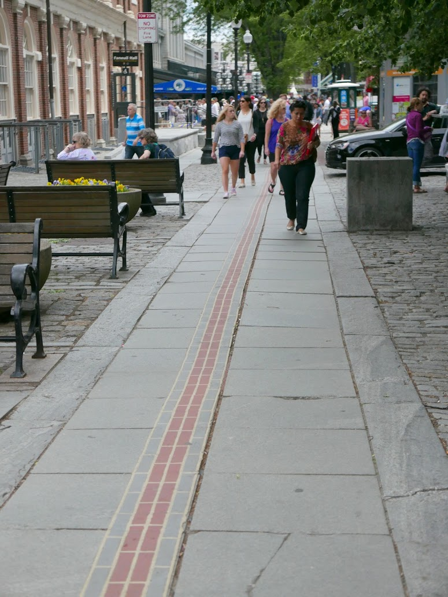

## Food

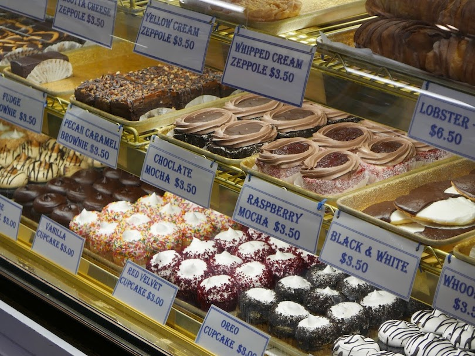

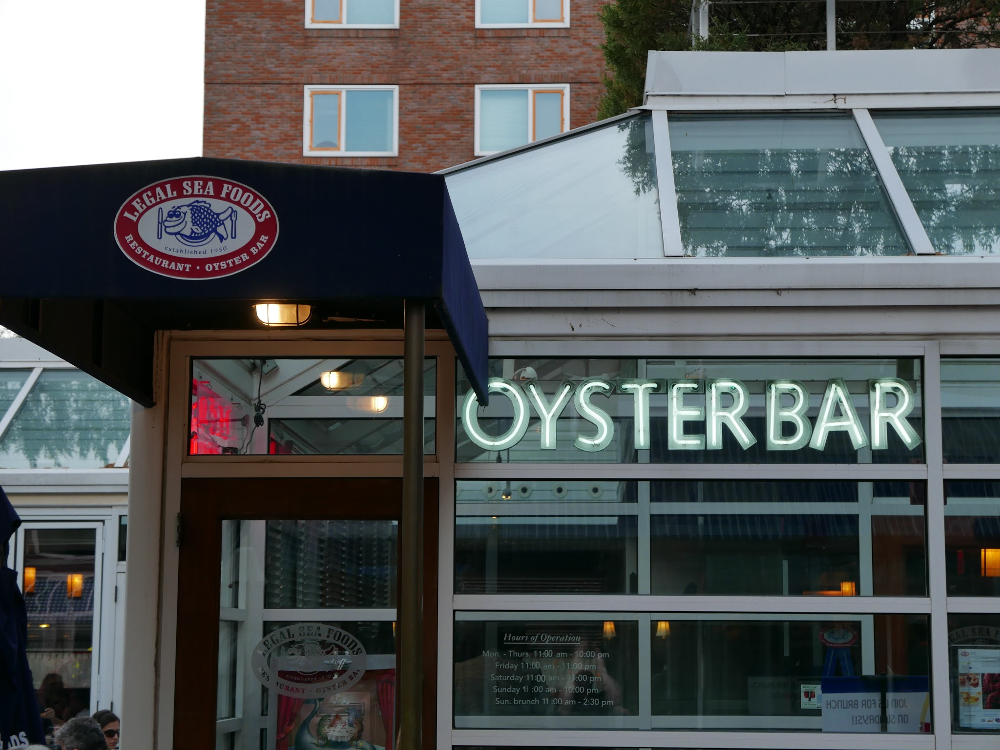

[Boston Public Market](https://bostonpublicmarket.org/)

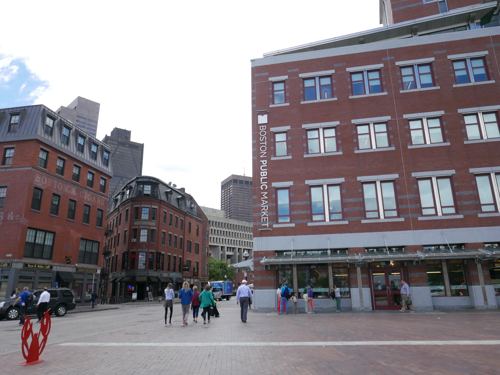

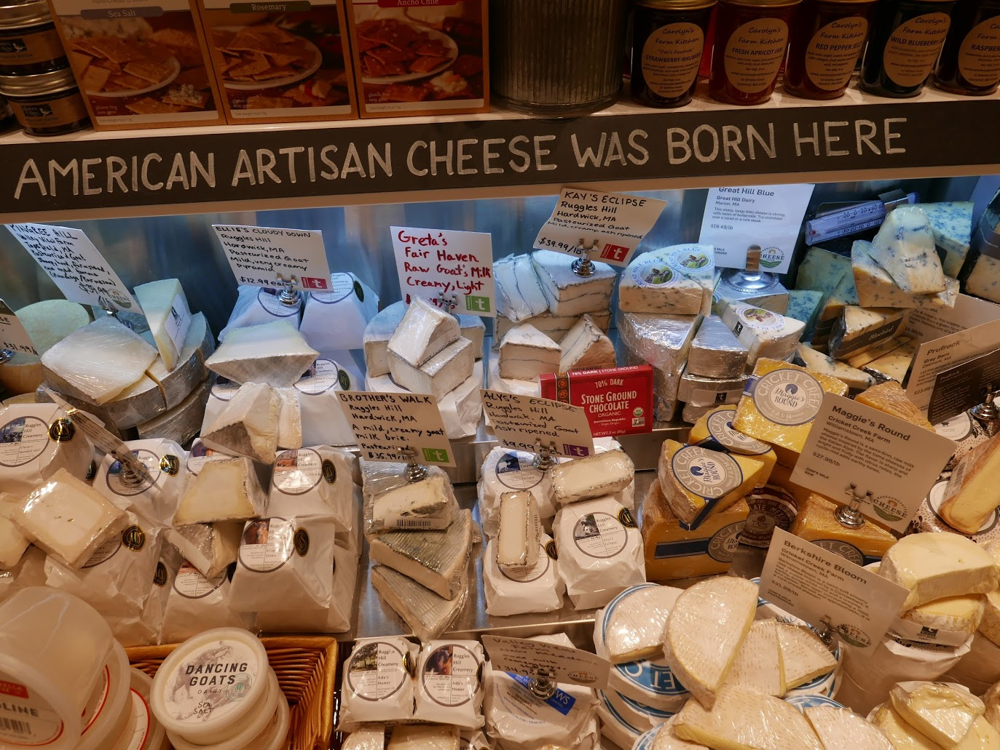

