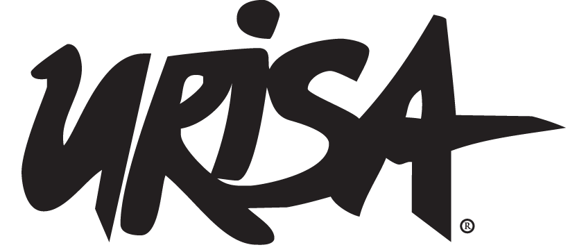
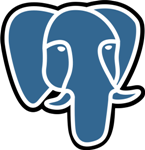
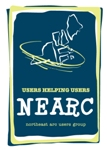
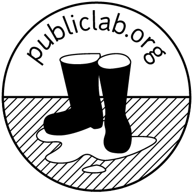

# Let's Build Community Together

{: .logo} {: .logo} {: .logo} {: .logo}

In an effort to grow and welcome a larger community on behalf of OSGeo, FOSS4G Boston 2017 is offering a **Community Partner Program**. We want to foster and build collaborations with other non-profit organizations in the FLOSS, Data, and Geospatial community. Through this program we offer:

-   **Half a table in the exhibit hall to promote your organization and projects**
-   **1 full pass to the conference**
-   **1 exhibitor pass** (access is limited to the exhibit hall)
-   **Recognition on the [FOSS4G homepage](<{{ site.baseurl }}/#sponsors>){:style="text-decoration:underline;"} as a Community Partner**

In return we are asking for your help in promoting [The OSGeo Community](http://www.osgeo.org){:style="text-decoration:underline;"} and the [FOSS4G Events](http://www.foss4g.org){:style="text-decoration:underline;"} on your website and/or at your events.

This is opportunity limited to **8** non-profit organizations.

If you are interested in applying, please email <mailto:foss4g2017@gmail.com>{:style="text-decoration:underline;"}
