# A Meaningful Opportunity

<<<<<<< HEAD
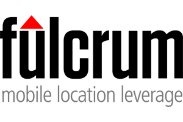{: .logo} 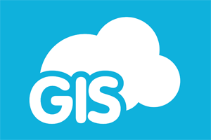{: .logo} {: .logo} 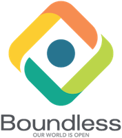{: .logo} {: .logo} 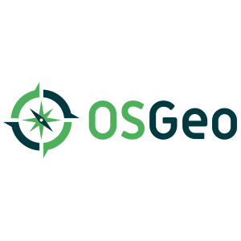{: .logo}  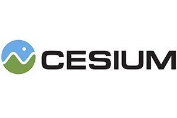{: .logo} 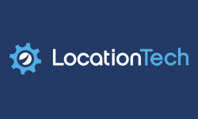{: .logo} 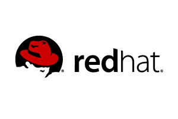{: .logo} 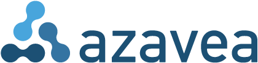{: .logo} {: .logo} 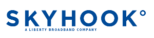{: .logo} 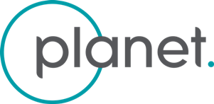{: .logo} {: .logo} {: .logo} 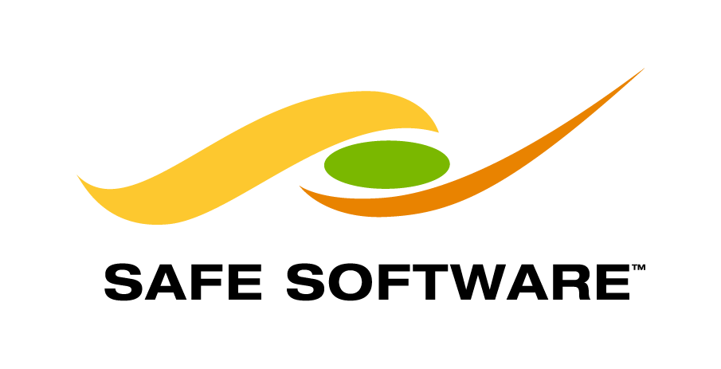{: .logo} 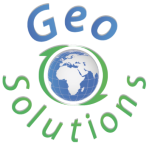{: .logo} {: .logo} 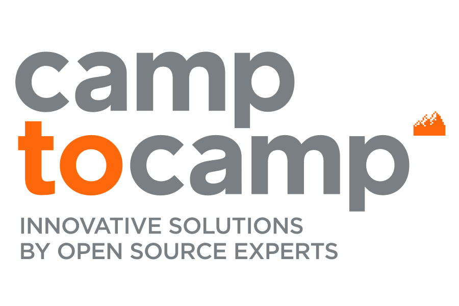{: .logo} {: .logo} {: .logo} {: .logo} {: .logo} {: .logo} {: .logo} {: .logo} {: .logo} {: .logo} {: .logo} {: .logo}{: .logo} {: .logo} {: .logo} {: .logo} {: .logo}

[Click here to become a sponsor](http://www.cvent.com/d/pvqgr8/4W){: .btn}

The FOSS4G Boston 2017 Sponsorship Committee has created a variety of sponsorship opportunities for the Boston event. Sponsoring FOSS4G, unlike other conferences, is not just about marketing - it is also a meaningful opportunity to give back and a powerful statement about your organization's role in the open source community. A healthy global conference is an important part of the geospatial open source ecosystem and strong sponsor support helps ensure users, developers, and contributors can connect and interact on improving the tools we all rely on.

The Boston Team is offering standard sponsor packages at the Supporter, Bronze and Silver levels. Our higher tiers – Diamond, Platinum and Gold – also include a variety of à la carte and customized benefits so that your investment in FOSS4G Boston 2017 can best meet your specific objectives for the conference.

Level     | Cost    | Included Registrations | Website Logo & Signage |  Booth   | Co-located Event | Named Meal | Named Social | T-shirt Sleeve
--------- | ------- | :--------------------: | :--------------------: | :------: | :--------------: | :--------: | :----------: | :------------:
Diamond   | $30,000 |           6            |           X            |  10x20   |        X         |     X      |      X       |       X
Platinum  | $20,000 |           4            |           X            |  10x20   |        X         |     X      |      X       |
Gold      | $15,000 |           3            |           X            |  10x10   |        X         |     X      |              |
Silver    | $8,000  |           2            |           X            |  10x10   |                  |            |              |
Bronze    | $4,000  |           1            |           X            | 6' Table |                  |            |              |
Supporter | $2,000  |           1            |           X            |          |                  |            |

For more information please view our [prospectus document](SponsorshipProspectus.pdf)

If you have any questions about our sponsorship offerings please email our [Sponsorship Team](mailto:foss4g2017@gmail.com). We want to make sure all your questions are answered and we'd be pleased to converse by email or setup a meeting with you.

[Click here to become a sponsor](http://www.cvent.com/d/pvqgr8/4W){: .btn}
