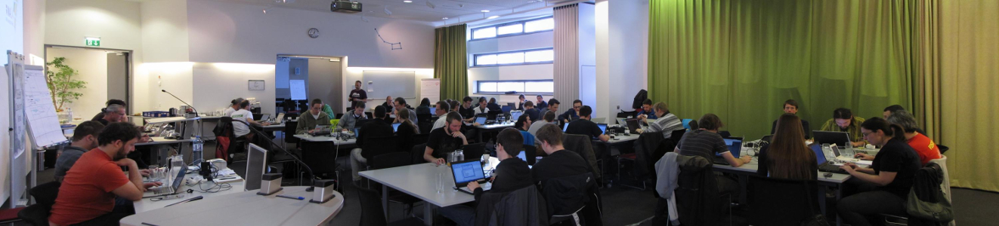

### Conference Workshops - August 14-15, 2017

##### Harvard University, Cambridge, MA, USA

<strong>Call for workshop instructors and content is now CLOSED. Thank you for all of your submissions!</strong>

NOTE: The final schedule will be placed online in early April, along with sign up links.

#### Pricing and Sign Up

Workshop Plan | Early Bird | Regular | # Wrk Shops | Price / Wkshop Early Bird | Price / Wkshop Regular
Four Workshops | $250 | $350 | 4 | $63 | $88
Two Workshops (any time) | $150 | $200 | 2 | $75 | $100
Single Workshop | $100 | $125 | 1 | $100 | $125

<a href="" class="btn">Sign Up Coming Soon!</a>

See below for lineup!

#### FOSS4G 2017 Conference Workshops

Workshops are an important and popular part of FOSS4G, and this year they will take place during the two days before the conference on <strong>Monday, August 14 and Tuesday, August 15</strong>. The workshops will be held at Harvard University’s Center for Geographic Analysis (CGA). The workshops will be run by experienced members of the open source community, and sometimes by the open source project developers themselves. This makes the workshops a great opportunity to advance your skills or take your first steps into the world of Open Source GIS. This year we are excited to introduce a Maptime track, focused on introductory skills and tutorials, and will be featuring <strong>workshops at a wide variety of skill levels</strong>.

#### Workshop Program

We are excited for all of the incredible workshops at this year's event. The Workshop Committee is working diligently on scheduling and in early April there will be links to signup. The following is the current lineup:

Workshop | Presenters & Affiliations | Topic
-------- | ------------------------- | --------
Building on the work of giants; A beginners guide for adding functionality using 3rd Party APIs. | Will Breitkreutz - U.S. Army Corps of Engineers | Web Mapping
GeoNode for developers|Simone Dalmasso - European Commission JRC; Francesco Bartoli - Geobeyond; Ariel Nunez - Terranodo; Jeffrey Johnson - Terranodo; Angelos Tzotsos - OSGeo | Web Mapping
Beginners guide to making your own web map with Leaflet and D3. | Niene Boeijen - Webmapper & Maptime Amsterdam | Web Mapping
Building Standards Compliant Geospatial Web Applications - the Quick and Easy MapMint Way | Gérald Fenoy - GeoLabs SARL; Venkatesh Raghavan - OCU | Web Mapping
Mapping with D3 | Mila Frerichs - Civic Vision | Web Mapping
Application development with OpenLayers | Tim Schaub - Planet Labs; Andreas Hocevar - Boundless | Web Mapping
Real-time Collaborative Mapping with GIS Cloud | Dino Ravnić - GIS Cloud | Web Mapping
Put your geodata to offline native mobile app | Jaak Laineste - CARTO | Web Mapping
Browser-based Geoprocessing with Turf.js and Leaflet | Numa Gremling - geoSYS; Martin Dresen - gis-trainer.com; Katrin Hannemann - gis-trainer.de | Web Mapping
Presenting bi-variate hex-grid maps in Leaflet or OpenLayers | Dennis Bauszus - GEOLYTIX | Web Mapping
Slippy maps, you complete me: A friendly step-by-step guide to serving up your own slippy web map tiles with tilehut.js | Joey Lee | Web Mapping
GIS in the Cloud: Get your GIS API Online with Docker + ECS | Saul Farber - PeopleGIS, Inc. | Server
Making a complete WebGIS Application with GeoMoose 3.0 | Dan "Ducky" Little | Server
Enterprise class deployment for GeoServer and GeoWebcache: optimizing performances and availability | Simone Giannecchini, GeoSolutions SAS; Andrea Aime, GeoSolutions SAS | Server
OGC Services in Action: an introduction with GeoServer  | Andrea Aime - GeoSolutions | Server
Growing a Geocoder: sprout in containers, transplant to the cloud | Diana Shkolnikov - Mapzen; Julian Simioni - Mapzen; Stephen Hess - Mapzen | Server
GeoServer & PostGIS in Containers and On Kubernetes | Steve Pousty - Red Hat | Server
Apache Solr Spatial Search | David Smiley | Server
Introduction to GeoNetwork | Antonio Cerciello - GeoCat; Jose Garcia - GeoCat; Juan Luis Rodríguez Ponce - GeoCat | Server
Building SDIs and geoportals with GeoNode and a search engine | Paolo Corti - Harvard CGA; Ben Lewis - Harvard CGA | Server
Classification of remote sensing images with the Orfeo ToolBox and QGIS | Manuel Grizonnet - CNES | Remote Sensing
Field data collection in disconnected environments: Portable OpenStreetMap (POSM) from start to finish | Emily Eros - American Red Cross; Seth Fitzsimmons - Pacific Atlas | OSM
Introduction to GeoTools | Ian Turton - Astun Technology; Jody Garnett, Boundless | Library
GeoTools DataStore Workshop  | Jody Garnett - Boundless; Ian Turton - Astun Technology | Library
PyWPS-4 | Jachym Cepicky | Library
ZOO-Project Introduction Workshop | GeoLabs SARL | Library
OGC SensorThings API with GOST | Steven Ottens - Geodan; Bert Temme - Geodan | IOT
From WebODM to QGIS | Lene Fischer - University of Copenhagen; Bo Victor Thomsen - Municipality Frederikssund | Drone
GeoSpatial outputs from flying robots: drone construction through photogrammetric alchemy | Stephen Mather - Cleveland Metroparks; Dakota Benjamin - Cleveland Metroparks; Tomas Holderness - MIT | Drone
Hands on with GDAL/OGR: a gentle introduction to command line GIS | Sara Safavi - Boundless; Sasha Hart - Boundless | Desktop
Introduction to QGIS plugin development | Marco Hugentobler - Sourcepole; Pirmin Kalberer - Sourcepole | Desktop
Processing lidar and UAV point clouds in GRASS GIS | Vaclav Petras - North Carolina State University; Anna Petrasova - North Carolina State University; Helena Mitasova - North Carolina State University | Desktop
Cartography with QGIS & Inkscape | Michele Tobias - UC Davis | Desktop
From GRASS GIS novice to power user | Vaclav Petras - North Carolina State University; Giuseppe Amatulli - Yale University;  Anna Petrasova - North Carolina State University | Desktop
Use GDAL and PKTOOLS for raster operations | Giuseppe Amatulli - Yale University; Vaclav Petras - North Carolina State University | Desktop
Introduction to Spatial Algorithms | Chris Barnett - Tufts University | Desktop
Mapping American Community Survey with R | Lee Hachadoorian - Temple University | Desktop
Geo with R? Yes We Can! | Tina A. Cormier - Woods Hole Research Center | Desktop
OSGeo-Live for Educators and Makers | Brian M Hamlin - OSGeo California Chapter | Desktop
Introduction to using QGIS with Fulcrum | Randy Hale - North River Geographic Systems, inc | Desktop
Introduction to GIS Using Open Source Software (Featuring QGIS) | Frank Donnelly - Baruch College CUNY; Janine Billadello - Baruch College CUNY; Anastasia Clark - Baruch College CUNY | Desktop
Breaking the 4th Dimension: Working with time in PostgreSQL and PostGIS | David Bitner - Boundless | Data
Using GeoBlacklight for Geospatial Discovery | Darren Hardy - Stanford University; Jack Reed - Stanford University | Data
Metadata Creation for Geospatial Resources  | Andrew Battista, NYU; Kim Durante, Stanford Univ;  Melinda Kernik, University of Minnesota; Karen Majewicz - University of Minnesota | Data
Analyzing large raster data in a Jupyter notebook with GeoPySpark on AWS | Rob Emanuele - Azavea | Data
From hours to seconds: Multi-dimensional indexing with GeoWave and HBase | Michael Whitby - DigitalGlobe/RadiantBlue; Rich Fecher - DigitalGlobe/Radiantblue | Data
Turning raster and census geometries into Hex-grids with PostGIS | Dennis Bauszus - GEOLYTIX | Data
Problem Solving with pgRouting | Leo Hsu and Regina Obe - Paragon Corporation | Data
Advanced Spatial Analysis with PostGIS | Pierre Racine - University Laval | Data
PostGIS and Spatial SQL for FOSS4G Rookies | Todd Barr | Data
pgRouting Workshop | Stephen Woodbridge - iMaptools.com | Data
Sales and Marketing 101 for FOSS4G Businesses: A workshop for Open Spatial IT Entrepreneurs | Steven Feldman - KnowWhere Consulting; Marc Vloemans | Business
Web 3D Geospatial Made Easy: An Introduction to Cesium | Rachel Hwang - AGI/University of Pennsylvania | 3D
Real-time 3D visualization of geospatial data using Blender | Payam Tabrizian - North Carolina State University; Anna Petrasova - North Carolina State University; Vaclav Petras - North Carolina State University; Brendan Harmon - North Carolina State University; Helena Mitasova - North Carolina Sate University | 3D

## Sign ups and Pricing

Pricing for workshops is as follows:

Workshop Plan | Early Bird | Regular | # Wrk Shops | Price / Wkshop Early Bird | Price / Wkshop Regular
Four Workshops | $250 | $350 | 4 | $63 | $88
Two Workshops (any time) | $150 | $200 | 2 | $75 | $100
Single Workshop | $100 | $125 | 1 | $100 | $125

<a href="" class="btn">Sign Up Coming Soon!</a>

## Workshop Details

#### Workshop Description and Environment

Most workshops are half-day (4 hour) and all provide hands-on experiences with participants following along with an instructor. There are a small number of full-day (8 hour) workshops in the lineup.

All workshops will be BYOD (Bring Your Own Device). OSGeo Live USB sticks will be provided to all workshop participants.

Instructors are strongly encouraged to develop material for attendees to take home with them, such as handouts, a workbook, CD-ROMs, etc.

#### Important Dates

Event | Date
----- | ----
Call for Workshops Announced | January 21, 2017
Call for Workshops Closed | March 13, 2017
Workshop Selections Announced | March 27, 2017
Detailed Workshop Program | April 3, 2017
Workshops Take Place at Harvard | August 14/15, 2017
